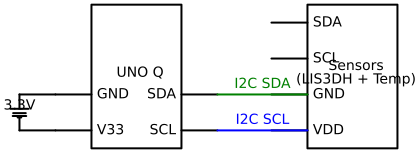

# EdgeGuard: AI-Powered Predictive Maintenance

## Story & Instructions (If I were a beginner...)

## Story: Why Build EdgeGuard? 

**The Bottom Line:** I needed to proactively predict the exact failure date of my 3D printers to prevent ruined prints, wasted filament, and missed production deadlines.

**The Details (How & Why):** 
Operating 3D printers at scale is an industrial challenge: when a bearing, fan, or stepper motor fails mid-job, the entire batch is lost. While massive factories have $100,000 predictive maintenance suites to catch this, there was no cost-effective way to retrofit these capabilities onto a standard print farm.

To solve this, I built EdgeGuard (Action). I retrofitted my equipment with an Arduino UNO Q and I2C vibration/temperature sensors. I chose the UNO Q because its dual-brain architecture is perfect for industrial workloads: the STM32 MCU buffers 400Hz real-time vibration data without dropping packets, while the Qualcomm Linux processor handles the heavy ONNX ML inference and syncs alerts to AWS Greengrass (Reason). 

For this hackathon, I specifically created a dedicated, standalone testbed—complete with a custom 3D printed enclosure—to clearly demonstrate how this hardware and software pipeline operates in a controlled, replicable environment.

**The Result:** 
By continuously analyzing the vibration signatures on the testbed, the Edge Impulse ONNX model successfully alerts me to mechanical degradation *before* the machine fails (Impact). Additionally, a custom variance check (`np.var`) automatically drops the UNO Q into an Adaptive Low-Power mode when the printer is idle, tracking my exact "Energy Waste" on an AWS-connected dashboard.

**Next Steps (Why you should build it):**
If you want to bring true industrial predictive maintenance to your own 3D printers (or any motor-driven machinery), follow the setup guide below. You'll learn how to build your own testbed, deploy an ML model to the edge, and sync data to the cloud. Grab your hardware and let's get started.


---

### Step-by-Step Setup


1. **Hardware Assembly:** Connect your I2C Vibration and Temperature sensors to the Arduino UNO Q's Qwiic or I2C headers.
2. **AI Training:** Using Edge Impulse, train your anomaly detection model on normal and anomalous vibration patterns. Export this as an **ONNX** model.
3. **Cloud Configuration:** Provision your UNO Q Linux environment with AWS Greengrass Core v2 to enable secure IPC MQTT networking and set up the `EdgeGuardModelShadow` for Over-The-Air (OTA) ML model updates.
4. **Deploy Component:** Use the included `recipe.yaml` to deploy the Python pipeline as a Greengrass component. The Unix socket bridge automatically connects the STM32 and Qualcomm brains.
5. **Dashboard:** Open `edgeguard-dashboard.html` to view real-time anomaly scores and Energy Waste KPIs.

---

## Complete Bill of Materials (BOM)

### Hardware
*   **Arduino UNO Q** (Featuring Qualcomm QRB2210 & STM32U585)
*   **LIS3DH Accelerometer** (For high-frequency 400Hz vibration ingestion)
*   **[Placeholder] Digital Temperature Sensor** (e.g., TMP117 or DHT22 for thermal anomaly correlation)
*   **Qwiic Cables / Jumper Wires**

### Software & Tools
*   **Arduino App Lab** (For bridging Python and the STM32 firmware)
*   **Edge Impulse** (For training the ONNX ML model)
*   **AWS Greengrass v2** (Free Tier - For edge-to-cloud MQTT messaging)
*   **Python 3.x** (For the core engine and local web server)
*   **AntV Infographic** (For our comprehensive system documentation)

---

## Schematics



Instead of a messy hand-drawn diagram, we generated our schematics programmatically using the Python `schemdraw` library. 

**Circuit Logic:**
*   **Vibration Sensor (LIS3DH) SCL/SDA** -> Connected to UNO Q I2C Pins.
*   **Temp Sensor SCL/SDA** -> Daisy-chained or parallel on the I2C bus.
*   **VCC / GND** -> Powered via UNO Q 3.3V out.

You can regenerate the exact, high-quality vector schematic by installing `schemdraw` (`pip install schemdraw`) and running the following Python script:

```python
import schemdraw
import schemdraw.elements as elm

with schemdraw.Drawing(file='EdgeGuard_Schematic.svg', show=False) as d:
    # Microcontroller (Arduino UNO Q)
    Q = elm.Ic(pins=[
        elm.IcPin(name='3V3', side='l', slot='1/4'),
        elm.IcPin(name='GND', side='l', slot='2/4'),
        elm.IcPin(name='SCL', side='r', slot='1/4'),
        elm.IcPin(name='SDA', side='r', slot='2/4'),
    ], edgepadW=.5, edgepadH=.5, pinspacing=1, leadlen=1, label='UNO Q')

    # Sensor Array
    S = elm.Ic(pins=[
        elm.IcPin(name='VDD', side='l', slot='1/4'),
        elm.IcPin(name='GND', side='l', slot='2/4'),
        elm.IcPin(name='SCL', side='l', slot='3/4'),
        elm.IcPin(name='SDA', side='l', slot='4/4'),
    ], edgepadW=.5, edgepadH=.5, pinspacing=1, leadlen=1, label='Sensors\n(LIS3DH + Temp)').at((6, 0))

    # Connections
    elm.Line().right().at(Q.SCL).to(S.SCL).color('blue').label('I2C SCL')
    elm.Line().right().at(Q.SDA).to(S.SDA).color('green').label('I2C SDA')
    
    # Power
    elm.Line().left(1).at(Q.3V3)
    elm.Vdd().label('3.3V')
    elm.Line().left(1).at(Q.GND)
    elm.Ground()
```

---

## Code & Contribution

The core value of this repository lies in `src/engine.py` and `src/bridge_receiver.py`. We have heavily refactored these to include:
*   **Non-blocking ThreadPoolExecutors:** To ensure the AWS MQTT HTTP requests never block the critical 400Hz real-time sensor loop.
*   **Helpful Comments:** Every function, especially the complex Unix socket IPC routing and anomaly thresholds, is heavily documented for beginner readability.

---

## Creativity (The "Fresh Take")

Predictive maintenance is not a new idea. However, **EdgeGuard offers a fresh, creative take** by heavily leveraging the specific hybrid architecture of the Arduino UNO Q to solve two major industrial problems at once: **Downtime and Energy Waste.**

*   **Dual-Brain Concurrency:** Instead of bottlenecking a single processor, we utilize the UNO Q's STM32 Cortex-M33 strictly for real-time sensor buffering. The heavy lifting (the ONNX ML inference and AWS Greengrass MQTT networking) is fully offloaded to the Qualcomm Cortex-A53 Linux core.
*   **AI-Powered Energy Optimization:** We creatively use simple statistics (`np.var` variance checks) on the STM32 side to detect idle states. When the machine is off, the system automatically drops into an Adaptive Low-Power Mode, saving energy and syncing an "Energy Waste" metric to the cloud.


